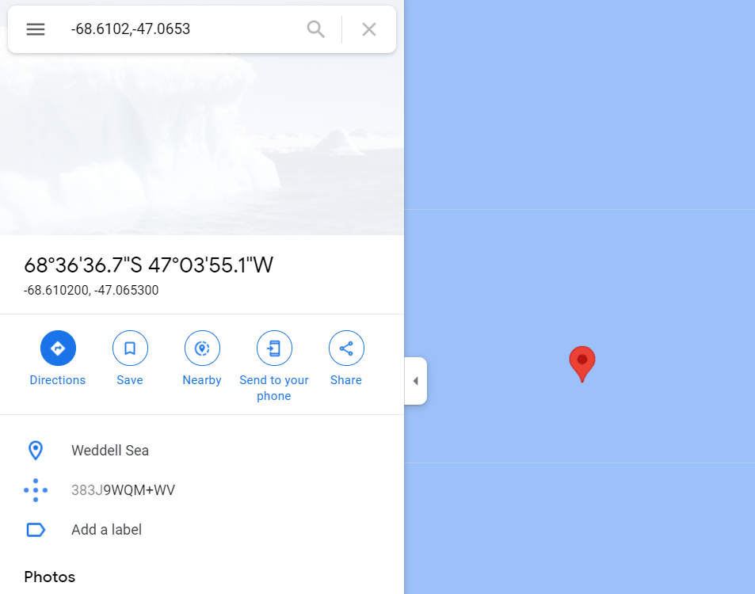

### Environment Setup:
0. [optional] set up conda environment
1. install nodejs
2. cd into directory of project (dependent on what the folder extracted into from zip file)
3. `npm install`
4. `npm start`
5. access the webpage from the either the default address `localhost:3000` in browser or others depending on your setting. 
### ScreenShots:

Modal accessible by clicking on each contact inside the list.

The address has a link that leads to the a Google map location provided in the sample geo json data that surprising lead to the middle of nowhere! lol.  



### Note:

packages in conda eenvironment includes:
```
> conda list
nodejs                    16.13.1              haa95532_0
vs2015_runtime            14.27.29016          h5e58377_2
```
### `npm start`

Runs the app in the development mode.\
Open [http://localhost:3000](http://localhost:3000) to view it in your browser.

The page will reload when you make changes.\
You may also see any lint errors in the console.
